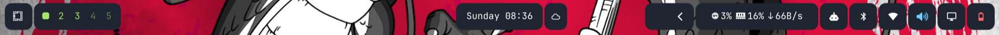

# Custom Bar

An Omarchy bar cloned from `omarchy.bar` and extended with a **floating
layout**, **transparency**, **Waybar-style per-widget pills** and **per-element
colors** — all configurable from `~/.config/omarchy/shell.json`.



This README covers **only what this plugin adds**. For stock behaviour (widget
catalogue, custom modules, bar gestures, the widget API) see the upstream
README at `/usr/share/omarchy/shell/plugins/bar/README.md`.

---

## Quick start

Everything lives under the `bar:` key of `~/.config/omarchy/shell.json`.
**Saving applies immediately** — no restart.

```json
{
  "bar": {
    "id": "josejaguirre.bar",
    "position": "top",

    "sizeHorizontal": 40,
    "marginGap": 4,
    "cornerRadius": 12,
    "opacity": 0.75,
    "contentPadding": 8,

    "pillBackground": "#1e2430",
    "pillForeground": "#ffffff",
    "pillRadius": 8,
    "pillPadding": 8,
    "pillSpacing": 2,
    "pillMargin": 4,

    "layout": {
      "left":  [ { "id": "omarchy.workspaces", "color": "#a6e36b" } ],
      "right": [ { "id": "omarchy.audio", "color": "#6bcfff" },
                 { "id": "omarchy.power", "color": "#ff6b6b" } ]
    }
  }
}
```

## How the pieces fit

```
├─ marginGap ········ lifts the bar off the screen edge
│  ┌─────────────────────────────────────────────┐ ─┐
│  │ ←contentPadding→ ╭──────────╮ ←pillSpacing→ │  │ sizeHorizontal
│  │                  │ ←pillPad→│               │  │
│  │                  ╰──────────╯               │  │
│  └─────────────────────────────────────────────┘ ─┘
                      └─ pill height = sizeHorizontal − 2 × pillMargin
```

---

## 1. Bar shape

| Key | Range | Default | What it does |
|---|---|---|---|
| `sizeHorizontal` | `8`–`400` px | *(see note)* | Height, when `position` is `top`/`bottom` |
| `sizeVertical` | `8`–`400` px | *(see note)* | Width, when `position` is `left`/`right` |
| `marginGap` | `0`–`200` px | `0` | Lifts the bar off the top and side edges |
| `cornerRadius` | `0`–`200` px | *(Hyprland rounding)* | Corner radius |
| `roundWhenFlush` | `true`/`false` | `false` | Keep the radius even when `marginGap` is 0 |
| `opacity` | `0.0`–`1.0` | `1` | Background transparency |
| `background` | `#RGB` / `#RRGGBB` | *(theme color)* | Bar color |
| `contentPadding` | `0`–`100` | `8` | Inset between the bar edge and the first/last widget |

```json
"marginGap": 8,
"cornerRadius": 12,
"opacity": 0.75,
"background": "#0d1117"
```

**Sizes are real pixels.** `sizeHorizontal` and `sizeVertical` shadow
`size-horizontal` / `size-vertical` from `shell.toml`, but **they are not the
same unit**: the TOML keys are multiplied by `fontScale` (`[font] base-size / 12`),
so `35` at `base-size = 11` renders a 32px bar. These are taken literally — `40`
means 40px — so the bar stops moving when the font size changes. Omit the keys
and the TOML behaviour comes back.

**`cornerRadius` is ignored when `marginGap` is 0.** A rounded bar flush against
the screen edge reads as a rendering bug. Use `roundWhenFlush: true` to keep it.

**`opacity` is absolute, not a multiplier.** The theme color can carry its own
baked-in alpha; it is forced opaque before your value is applied, so `opacity: 1`
is reliably opaque. The `transparent: true` flag means "no background at all"
and takes priority.

---

## 2. Per-widget pills

Waybar style: every widget gets its own rounded background.

| Key | Range | Default | What it does |
|---|---|---|---|
| `pillBackground` | `#RGB` / `#RRGGBB` | `""` *(off)* | Pill color — **this is the switch** |
| `pillForeground` | `#RGB` / `#RRGGBB` | *(automatic)* | Text and icon color |
| `pillRadius` | `0`–`100` px | `8` | Pill corner radius |
| `pillPadding` | `0`–`60` px | `8` | Inner padding beside the content |
| `pillSpacing` | `0`–`60` px | `6` | Gap between pills |
| `pillMargin` | `0`–`60` px | `4` | Gap between a pill and the bar edge |

```json
"pillBackground": "#1e2430",
"pillRadius": 8,
"pillSpacing": 6
```

With no `pillBackground` nothing is drawn and the bar looks stock. One key is
both the switch and the value.

**Every pill is the same size**: `sizeHorizontal − 2 × pillMargin`. `pillPadding`
only acts along the bar's main axis; if it applied to the cross axis too, each
pill would size to whatever its widget draws and you would get uneven heights.
Grow the bar and the pills grow with it.

**Pills stay opaque even when the bar is translucent**, as in Waybar. Pair
`opacity: 0.6` with `marginGap` to make the bar nearly vanish and leave the
pills floating.

**A widget with no content gets no pill.** `omarchy.indicators` collapses when
none is active, `omarchy.spacer` is deliberately blank, and `keepSpace` reserves
room for empty labels — none of them gets a pill, nor the padding that would
make an empty one visible.

### `pillForeground` — pinned text color

```json
"pillBackground": "#1e2430",
"pillForeground": "#ffd782"
```

By default the bar calls `omarchy-bar-text-color`, which samples the wallpaper
under the bar and picks light or dark text from its luminance. That is right for
text sitting directly on the desktop, and **wrong once it sits on an opaque
pill**: the sampled surface is no longer the one behind the glyphs.
`pillForeground` pins the color.

It only applies **with `pillBackground` set**. With no pill there is nothing to
pin the color to, so it is ignored and logged rather than silently defeating the
auto-contrast.

---

## 3. Per-element color

Any layout entry accepts `color`:

```json
"layout": {
  "left": [
    { "id": "omarchy.menu" },
    { "id": "omarchy.workspaces", "color": "#a6e36b" }
  ],
  "right": [
    { "id": "omarchy.audio", "color": "#6bcfff" },
    { "id": "omarchy.power", "color": "#ff6b6b" }
  ]
}
```

Without the key, the widget uses `pillForeground` or the automatic color. It
coexists with the entry's other settings:

```json
{ "id": "omarchy.clock", "format": "HH:mm", "color": "#ffd782" }
```

It colors the widget's text and icons. The tray's full-color application icons
and the urgent/active states are **not** touched: only `foreground` is assigned —
the property `WidgetButton` derives its color from — so anything painted another
way is left alone by construction.

It also covers widgets with dynamic children: `omarchy.workspaces` builds its
buttons in a `Repeater` and they all get the color, including ones that appear
when you open a new workspace.

---

## Validation

Colors accept `#RGB` and `#RRGGBB`. **Alpha is deliberately not accepted**:
`opacity` is the single owner of transparency, so a hex value can never fight it.

A malformed value is ignored, falls back to the default, and is logged — it never
fails silently or renders the bar black:

```
bar: ignoring invalid background "rojo" -- expected "#RGB" or "#RRGGBB"; using the theme color
bar: ignoring invalid color "#zzz" on widget "omarchy.clock" -- expected "#RGB" or "#RRGGBB"
bar: ignoring pillForeground -- it only applies with pillBackground set; leaving the automatic light/dark text color in charge
```

To watch them:

```bash
journalctl --user -f | grep "bar:"
```

Numeric values are clamped to their range rather than rejected: one extra zero
will not push the bar off screen.

---

## Maintenance notes

**`shell.json` hot-reloads; `shell.toml` does not.** TOML changes need
`omarchy restart shell`.

**Patched against upstream.** `Bar.qml` declared `omarchyPath`,
`barWidgetRegistry` and `barConfig` as `required`. The stock bar is built from a
`Component` that assigns them at construction, but a cloned bar loads through
`Loader { source: <url> }`, which cannot supply initial values: QML refuses to
instantiate and **nothing is drawn at all**. Here they are declared without
`required` and with defaults; `configureBar()` assigns them immediately after
construction anyway. Upstream bug
[#8007](https://github.com/basecamp/omarchy/issues/8007), fixed by
[PR #8146](https://github.com/basecamp/omarchy/pull/8146) via
`Loader.initialProperties`. Once that ships in a stable release, `required` can
be restored.

**Diffing against upstream** to pull in changes:

```bash
diff /usr/share/omarchy/shell/plugins/bar/Bar.qml Bar.qml
```

`omarchy update` never touches this plugin, but it never brings it stock
improvements either.
